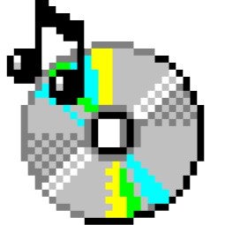

  
<h3>Blog by Vero</h3>

Personal blog made using the Rust programming language

## About the blog
I made this blog as a way to store thoughts, writings, pictures, and other stuff that i'd usually upload to social media.